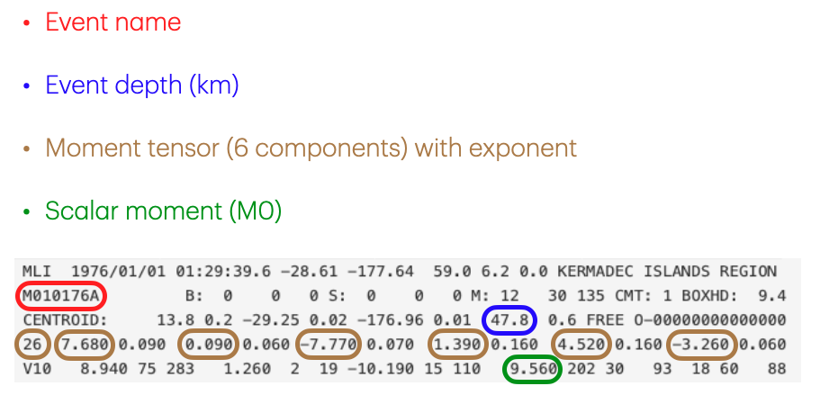

# Data Storage Hands-on

## Environment setup
#### Log in to Adroit:
```sh
ssh <user_name>@adroit.princeton.edu
```

#### Launch interactive shell

##### Python
```sh
module load anaconda3/2025.12
conda create -n data-ws python=3.14
conda activate data-ws
conda install h5py
python
```

##### MatLab
```sh
module load matlab/R2025b
matlab
```

## Part 1: Download and extract data

#### Global Centroid-Moment-Tensor (CMT) catalog
We use earthquake records from 1976 to 2020 from [Global CMT Catalog](https://www.globalcmt.org). More description on the format of the earthquake record can be found [here](https://www.ldeo.columbia.edu/~gcmt/projects/CMT/catalog/allorder.ndk_explained). The catalog will be saved as a text file `jan76_dec20.ndk`.

```sh
#!/bin/sh
wget https://www.ldeo.columbia.edu/~gcmt/projects/CMT/catalog/jan76_dec20.ndk
```

#### Extract and save data
We need depth, moment magnitude and six moment tensor components for each earthquake. Save them in a format that you think makes sense for processing.



## Part 2: Process saved data
1. Calculate the min, max and median of earthquake depths
2. Calculate the Moment magnitude of each earthquake `Mw = (2/3)*(log10(M0) - 16.1)` and count earthquakes with moment magnitude greater than 8.0
3. Find the maximum absolute value among the moment tensor components of all earthquakes
4. Save the results

## Part 3: Compile and install ADIOS2 for parallel write
Installing serial version adios2 for Python is straight-forward
```sh
conda install conda-forge::adios2
```
or
```sh
pip install adios2
```
However, compiling from the source is required to enable parallel write or MatLab support. More details can be found in
[ADIOS2 Documentation](https://adios2.readthedocs.io/en/v2.11.0/setting_up/setting_up.html)

```sh
git clone https://github.com/ornladios/ADIOS2.git ADIOS2
mkdir adios2-build && cd adios2-build
module load openmpi/gcc/4.1.6
module load anaconda3/2025.12
conda activate data-ws
pip install --force-reinstall --no-binary :all: mpi4py
mkdir dist
cmake ../ADIOS2 -DADIOS2_USE_Python=ON -DPYTHON_EXECUTABLE=~/.conda/envs/data-ws/bin/python -DPython_FIND_STRATEGY=LOCATION -DCMAKE_INSTALL_PREFIX=$(pwd)/dist
make -j 16
make install
conda develop dist/lib64/python3.9/site-packages/
```

#### Test parallel write
Create Python script `test.py`
```py
from mpi4py import MPI
import numpy as np
from adios2 import Stream

comm = MPI.COMM_WORLD
rank = comm.Get_rank()
size = comm.Get_size()

nx = 10
shape = [size * nx]
start = [rank * nx]
count = [nx]

temperature = np.zeros(nx, dtype=np.double)
pressure = np.ones(nx, dtype=np.double)
delta_time = 0.01
physical_time = 0.0
nsteps = 5

with Stream("cfd.bp", "w", comm) as s:
   # NSteps from application
   for _ in s.steps(nsteps):
      if rank == 0 and s.current_step() == 0:
         # write a Python integer
         s.write("nproc", size)

      # write a Python floating point value
      s.write("physical_time", physical_time)
      # temperature and pressure are numpy arrays
      s.write("temperature", temperature, shape, start, count)
      s.write_attribute("temperature/unit", "K")
      s.write("pressure", pressure, shape, start, count)
      s.write_attribute("pressure/unit", "Pa")
      physical_time += delta_time
```

Create job script `job.bash`
```sh
#!/bin/bash
#SBATCH --nodes=1
#SBATCH --tasks=4
#SBATCH --time=00:01:00
srun -n 4 python test.py
```

Submit job script
```sh
sbatch job.bash
```

Check result after job finishes
```sh
~/adios2-build/dist/bin/bpls -la cfd.bp
```
which should produce output
```
  int64_t  nproc             scalar = 4
  double   physical_time     5*scalar = 0 / 0.04
  double   pressure          5*{40} = 1 / 1
  string   pressure/unit     attr   = "Pa"
  double   temperature       5*{40} = 0 / 0
  string   temperature/unit  attr   = "K"
```